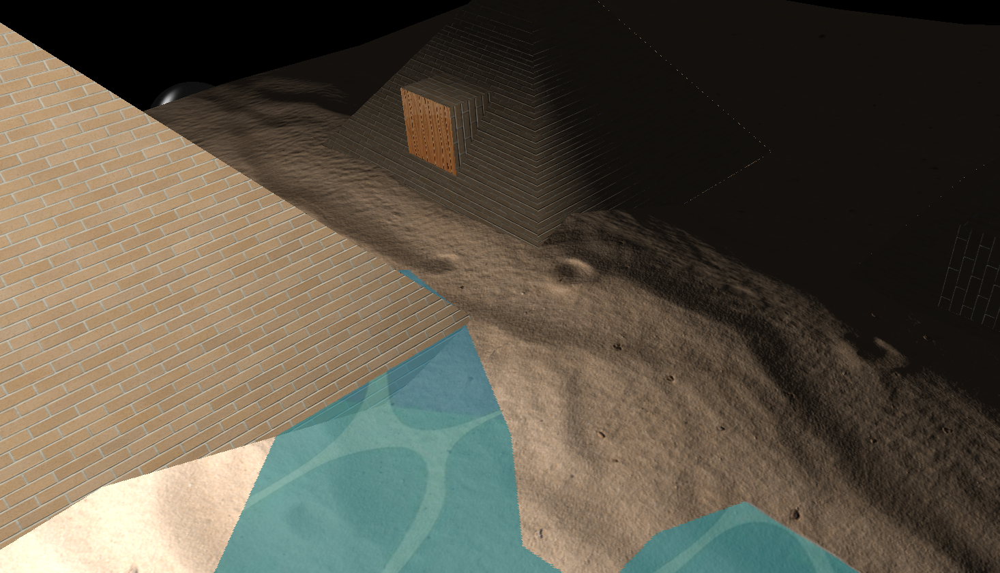
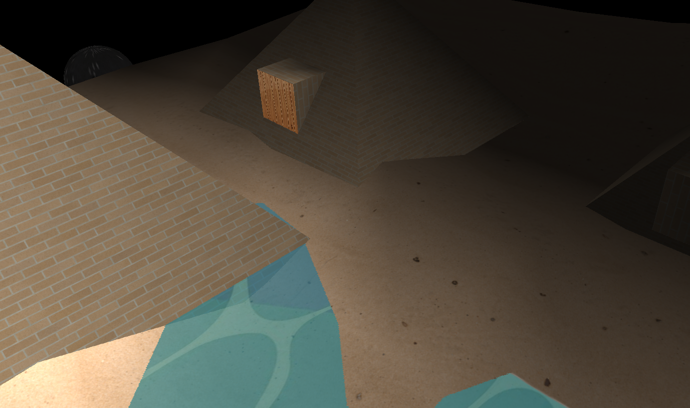
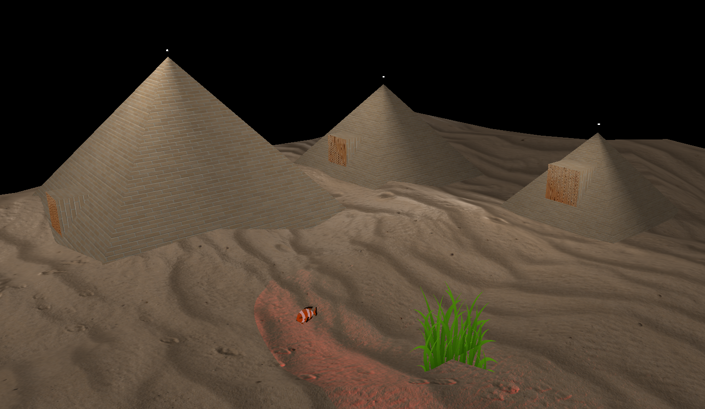

# egipt3d-opengl

# 1.1 Perspective projection

# 1.2 3D Model Loading

## 1.2.1 Pyramid loaded from custom 3D model

## 1.2.2 Huge Clown Fish

## 1.2.3 Moon and Sun rotation

# 2.1 Fish Swimming In The Lake

# 3.1 Lighting

# 3.2 Specular and diffuse maps

# 3.3 Switching between Gouard and Phong light model

# 3.4 Multiple Light Casters

